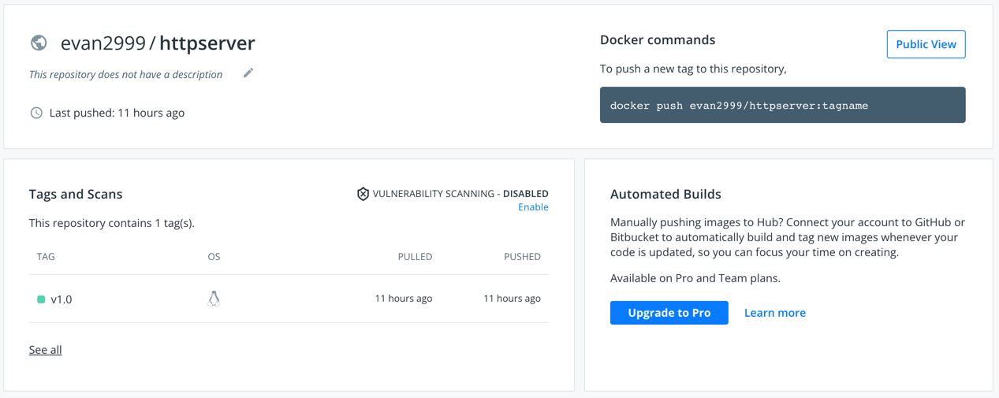
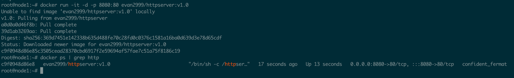
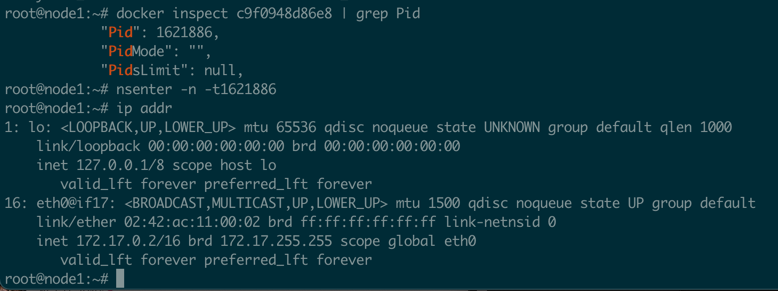

## 模快三作业
### 作业要求
```
·构建本地镜像。
·编写 Dockerfile 将练习 2.2 编写的 httpserver 容器化（请思考有哪些最佳实践可以引入到 Dockerfile 中来）。
·将镜像推送至 Docker 官方镜像仓库。
·通过 Docker 命令本地启动 httpserver。
·通过 nsenter 进入容器查看 IP 配置。
·作业需编写并提交 Dockerfile 及源代码。
```
### 作业说明
#### make说明  

| Command              | Description                                             |
| ---------------------| ------------------------------------------------------- |
| make build           | 本地编译二进制程序                                         |
| make image           | 本地构建docker镜像                                        |
| make push            | 将本地构建好的镜像推送到docker官方镜像仓库                    |
| make clean           | 删除本地二进制文件和镜像                                    |

#### 镜像推送到Docker官方镜像仓库


### 通过 Docker 命令本地启动 httpserver


### 通过 nsenter 进入容器查看 IP 配置


